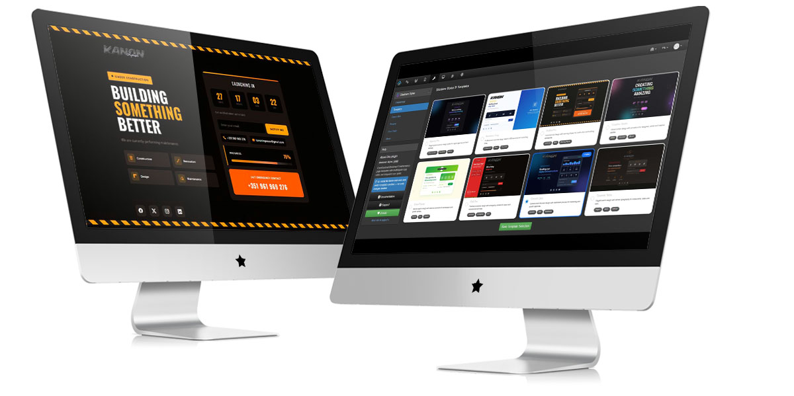
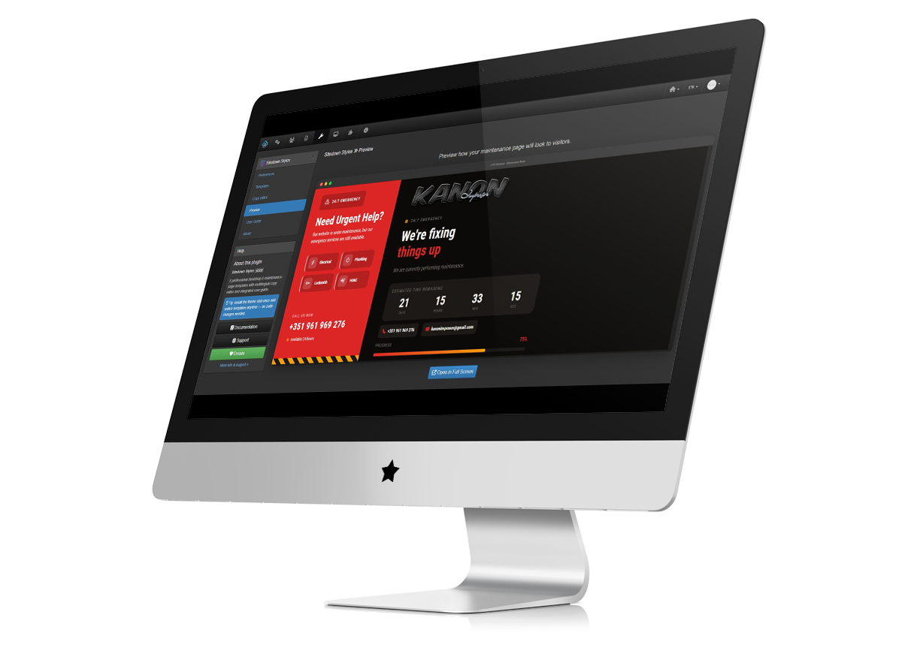
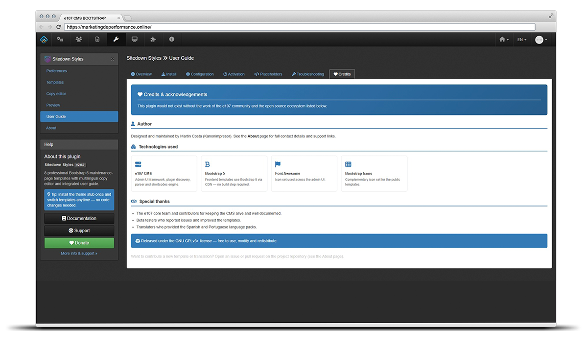
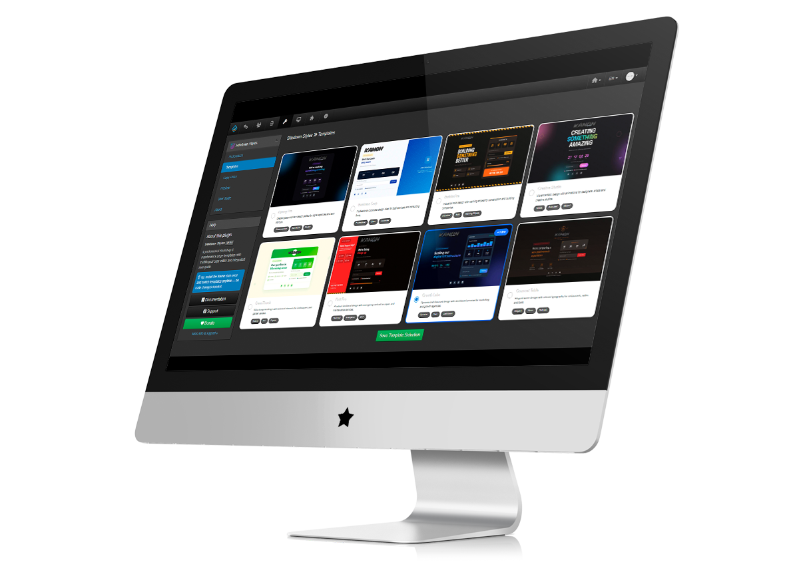
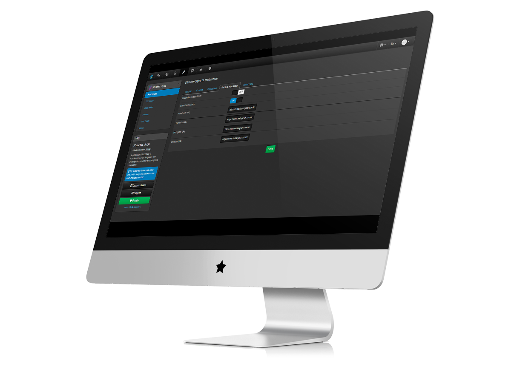
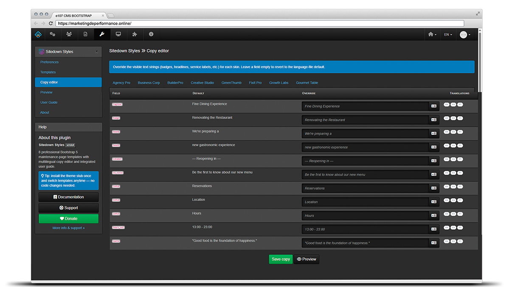
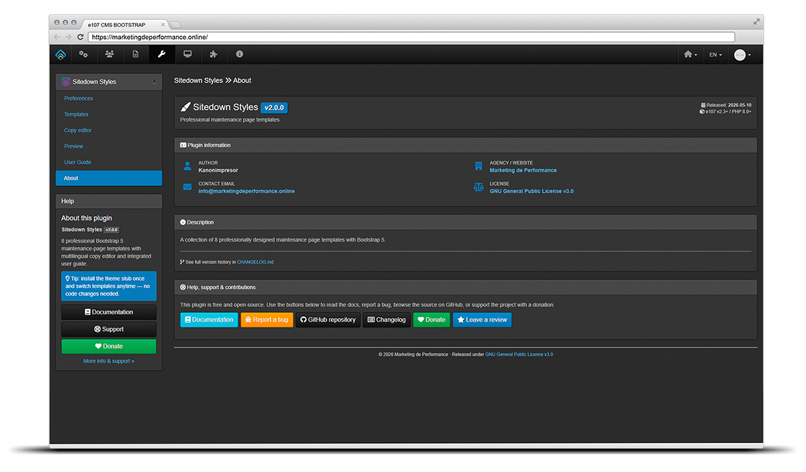

# Sitedown Styles Plugin for e107

Professional maintenance page templates for e107 CMS with 8 unique designs for different business niches.


#### Choose your language below / Elija su idioma abajo / Escolha o seu idioma abaixo

[](README.md)
[](README.pt-PT.md)
[](README.es-ES.md)

---



> **v2.1.0 — User Guide 4-layer architecture.** Pure refactor: the in-admin Help system is now split into Controller / Template / `<Lang>_admin_help.php` (lazy-loaded) / Shortcodes-with-logic-only. Zero behavioural change. Full design doc in [`docs/architecture/USER_GUIDE_PATTERN.md`](docs/architecture/USER_GUIDE_PATTERN.md).
>
> **v2.0.0 — Master template architecture.** All 8 skins share a single semantic skeleton (`templates/sitedown_styles_template.php`) and are styled through `css/<skin>.css`. Per-skin texts can be customised from the admin **Texts** page without editing code or language files. See [`CHANGELOG.md`](CHANGELOG.md) for full details.

## 🎨 Available Templates

| Template | Style | Best For |
|----------|-------|----------|
| **Agency Pro** | Glassmorphism, Dark | Digital agencies, Tech startups |
| **Business Corp** | Professional, Clean | B2B services, Consulting firms |
| **BuilderPro** | Industrial, Bold | Construction, Building companies |
| **Creative Studio** | Vibrant, Animated | Designers, Artists, Creative studios |
| **GreenThumb** | Natural, Organic | Landscapers, Garden centers |
| **FixIt Pro** | Practical, Emergency | Repair services, Handyman |
| **Growth Labs** | Dynamic, Tech | Marketing agencies, Growth hackers |
| **Gourmet Table** | Elegant, Warm | Restaurants, Cafes, Bars |

## ✨ Features

- 🎯 **8 Professional Templates** - Each with unique design aesthetics
- ⏱️ **Countdown Timer** - Configurable launch date with live countdown
- 📊 **Progress Bar** - Show maintenance progress to visitors
- 📧 **Newsletter Form** - Collect emails for launch notifications
- 🔗 **Social Media Links** - Connect with your audience
- 📱 **Fully Responsive** - Perfect on all devices
- 🎨 **Bootstrap 5** - Modern, reliable framework
- 🔧 **Easy Configuration** - Visual admin panel with preview
- 🌍 **Multi-language** - English and Spanish included

## 📦 Installation

### Step 1: Upload Plugin

1. Download the plugin package
2. Extract to `e107_plugins/sitedown_styles/`
3. Go to **Admin → Plugin Manager**
4. Find "Sitedown Styles" and click **Install**

### Step 2: Theme Integration

> ⚠️ **Required**: installing the plugin alone does NOT hook the maintenance page. You must copy the integration stub into your active theme so it wins e107's template cascade.

Cascade order resolved by `sitedown.php` (root):

1. `THEME/templates/sitedown_template.php` ← **target**
2. `THEME/sitedown_template.php` (legacy v1.x)
3. `e_CORE/templates/sitedown_template.php` (bare default)

Copy the integration file to your active theme:

```bash
# From plugin folder
cp e107_plugins/sitedown_styles/theme_integration/sitedown_template.php \
   e107_themes/YOUR_THEME/templates/sitedown_template.php
```

Or manually copy `theme_integration/sitedown_template.php` to:
```
e107_themes/YOUR_THEME/templates/sitedown_template.php
```

### Step 3: Configure

1. Go to **Admin → Sitedown Styles**
2. Select your preferred template
3. Configure countdown, social links, and contact info
4. Save settings

## 🎮 Usage

### Activating Maintenance Mode

1. Go to **Admin → Users → User &amp; Guest Maintenance** (`/e107_admin/ugflag.php`)
2. Set **Maintenance Mode = ON** and save
3. Open the site in an incognito window — every URL returns HTTP 503 with your selected template

> 💡 Main Admin (perm `0`) always bypasses the flag and can preview at `/sitedown.php` even when maintenance is OFF.

### Admin Preview

- Admins can preview the maintenance page without enabling maintenance mode
- Visit `/sitedown.php` while logged in as Main Admin
- Or use the **Preview** tab in the plugin settings
- Per-style direct URL (admin only): `/e107_plugins/sitedown_styles/preview.php?style=<key>`



### In-Admin User Guide

The plugin ships with a built-in **User Guide** tab (Admin → Sitedown Styles → User Guide) covering Overview, Install, Configuration, Activation, Placeholders and Troubleshooting. The Install tab includes a live status badge that detects whether the theme integration stub is present. All copy is fully translatable via `LAN_PLUGIN_SS_HELP_*` constants in `languages/<Lang>/<Lang>_admin_help.php` (lazy-loaded only when the tab is opened — see [USER_GUIDE_PATTERN.md](docs/architecture/USER_GUIDE_PATTERN.md)).



## ⚙️ Configuration Options

### Template Tab
- Select from 8 professional templates
- Visual preview of each design



### Content Tab
- Custom title (optional)
- Custom message/subtitle
- Logo image upload



### Countdown Tab
- Enable/disable countdown timer
- Set launch date and time
- Enable/disable progress bar
- Set progress percentage

### Social & Newsletter Tab
- Enable/disable newsletter form
- Enable/disable social links
- Facebook, Twitter, Instagram, LinkedIn URLs

### Contact Tab
- Emergency phone number
- Contact email address

## 📁 File Structure

```
e107_plugins/sitedown_styles/
├── plugin.xml              # Plugin definition
├── plugin.php              # Main plugin class
├── admin_config.php        # Admin panel (Templates / Settings / Texts / Preview / Guide)
├── e_sitedown.php          # Sitedown hook handler + skin extension API
├── preview.php             # Template preview (?style=<key>)
├── CHANGELOG.md            # Release notes
├── README.md               # This file
├── languages/
│   ├── English/English_admin.php
│   └── Spanish/Spanish_admin.php
├── css/                    # v2 — per-skin stylesheets
│   ├── _base.css           #   shared reset, layout, widget skeletons
│   ├── agency.css
│   ├── business.css
│   ├── construction.css
│   ├── creative.css
│   ├── gardening.css
│   ├── handyman.css
│   ├── marketing.css
│   └── restaurant.css
├── templates/
│   └── sitedown_styles_template.php   # master semantic skeleton (the only template)
├── theme_integration/
│   └── sitedown_template.php
└── images/
    └── previews/
```

## 🔧 Requirements

- e107 CMS v2.3.0 or higher
- PHP 7.4 or higher
- MySQL 5.7 or higher

## �️ Architecture (v2)

Since v2.0.0 every skin is rendered through a **single master template** + a **per-skin CSS file**, instead of 8 monolithic PHP templates.

```
templates/sitedown_styles_template.php   ← semantic skeleton with {SS_*} placeholders
css/_base.css                            ← reset, layout, shared widget skeletons
css/<style>.css                          ← per-skin colours, fonts, decor
e_sitedown.php → render*Block() hooks    ← skin-specific HTML extensions
```

### Skin extension API (`e_sitedown.php`)

If a skin needs custom markup beyond CSS, override one of these four hooks:

| Hook | Purpose |
|------|---------|
| `renderLogoBlock($style, $copy)`     | Custom brand markup (e.g. restaurant ornate icons) |
| `renderFeaturesBlock($style, $copy)` | Service chips, metrics, info-cards… |
| `renderExtraBlock($style, $copy)`    | Secondary widgets (dashboards, progress, emergency boxes) |
| `renderDecor($style, $copy)`         | Background and decorative layers |

### Texts editor

Admin → *Sitedown Styles* → **Texts** lets you override every per-skin `TPL_*` string (badge, countdown label, contact line, tagline, …) via prefs. Empty values fall back to the language file defaults.



### Legacy fallback

The 8 v1 monolithic templates were removed in v2.0.0. All rendering now goes through the master template + skin CSS.

## �🎨 Customization

### Creating Custom Templates

1. Copy an existing template from `templates/` folder
2. Rename to `yourname_template.php`
3. Modify the HTML/CSS as needed
4. Add your template to the style selector (requires code modification)

### Available Shortcodes

Use these placeholders in custom templates:

| Shortcode | Description |
|-----------|-------------|
| `{SITENAME}` | Site name from e107 settings |
| `{SITEURL}` | Site URL |
| `{SITEDOWN_STYLES_TITLE}` | Custom title or default |
| `{SITEDOWN_STYLES_SUBTITLE}` | Custom message or default |
| `{SITEDOWN_STYLES_LOGO}` | Logo HTML or site name |
| `{SITEDOWN_STYLES_COUNTDOWN}` | Countdown timer HTML |
| `{SITEDOWN_STYLES_COUNTDOWN_JS}` | Countdown JavaScript |
| `{SITEDOWN_STYLES_PROGRESS}` | Progress bar HTML |
| `{SITEDOWN_STYLES_NEWSLETTER}` | Newsletter form HTML |
| `{SITEDOWN_STYLES_SOCIAL}` | Social links HTML |
| `{SITEDOWN_STYLES_PHONE}` | Contact phone |
| `{SITEDOWN_STYLES_EMAIL}` | Contact email |

## 🐛 Troubleshooting

### Template not showing
1. Verify `sitedown_template.php` is in your theme's `templates/` folder
2. Check plugin is installed and active
3. Clear e107 cache

### Logout redirects to home, not the maintenance page
- The maintenance flag (`maintainance_flag`) is OFF. Activate it in `/e107_admin/ugflag.php`.
- Main Admin always bypasses the flag — test in incognito.

### Settings tab does not persist changes
- The admin menu key must be `main/prefs`. Custom action names (e.g. `main/settings`) bypass the framework's `PrefsObserver`/`PrefsSaveTrigger` and silently discard the form.

### 404 on `/…/fa-paint-brush.glyph` after login
- `adminLinks` in `plugin.xml` does NOT support the `.glyph` icon syntax. Use real PNG paths under `images/`.

### Fatal `TypeError: Cannot access offset of type string on string` on uninstall
- Empty XML container tags in `plugin.xml` (`<userClasses></userClasses>`, `<dependencies></dependencies>`…) are parsed as `""` under PHP 8+. Remove them or populate them.

### Countdown not working
1. Ensure JavaScript is enabled in browser
2. Check countdown date is set in admin panel
3. Verify countdown is enabled in settings

### Styles not loading
1. Check Bootstrap CSS CDN is accessible
2. Verify no JavaScript errors in browser console
3. Try clearing browser cache

## 📄 License

This plugin is released under the GNU General Public License v3.0

## 👨‍💻 Author

**Martin Costa — Marketing de Performance**
- Website: [marketingdeperformance.online](https://marketingdeperformance.online)
- Email: info@marketingdeperformance.online

## 🙏 Credits

- [e107 CMS](https://e107.org) - Content Management System
- [Bootstrap 5](https://getbootstrap.com) - CSS Framework
- [Bootstrap Icons](https://icons.getbootstrap.com) - Icon Library
- [Google Fonts](https://fonts.google.com) - Typography

The plugin also ships with an **About** tab in the admin showing version, license and author info at a glance:



---

Made with ❤️ for the e107 community
